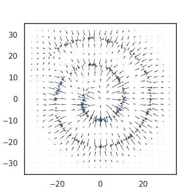
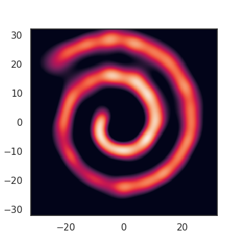

# Nonparametric Score Estimators

Yuhao Zhou, Jiaxin Shi, Jun Zhu. https://arxiv.org/abs/2005.10099

## Toy Example

```
python -m examples.spiral --lam=1.0e-5 --kernel=curlfree_imq --estimator=nu
```



## Dependencies

```
Tensorflow >= 1.14.0
```

